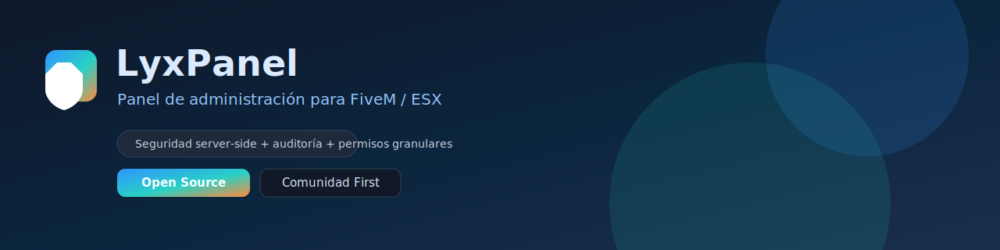
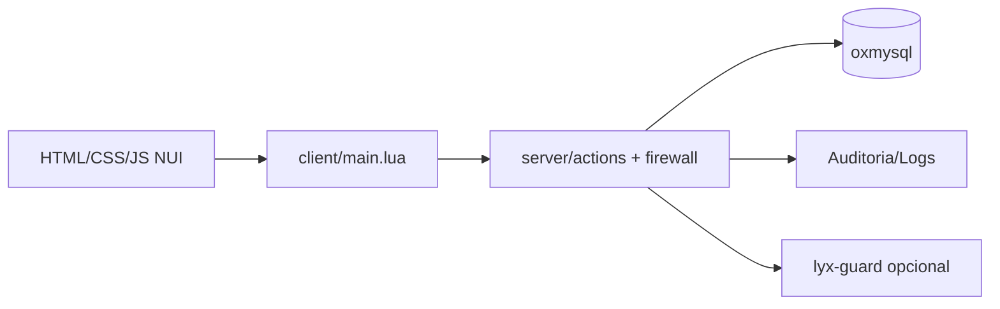

# LyxPanel



Panel de administracion **open source** para FiveM/ESX, enfocado en seguridad server-side, auditoria real y permisos granulares.

## Estado del proyecto
- Licencia: `MIT`
- Estado: `Activo`
- Enfoque: `Comunidad primero` (gratis y libre)
- Integracion recomendada: `lyx-guard`

## Que incluye
- Panel NUI completo: jugadores, economia, vehiculos, reportes, bans, auditoria y permisos.
- Matriz de permisos por rol/usuario editable desde UI (sin tocar JSON/CFG complejos).
- Firewall de eventos para acciones admin criticas:
  - permiso
  - rate-limit
  - schema validation
  - token + nonce + anti-replay
- Auditoria avanzada con filtros y export `JSON/CSV`.
- Presets de admin:
  - self presets
  - vehicle builds
  - favoritos de vehiculos
  - historial de spawn
- Modo simulacion (`dry-run`) para acciones destructivas.

## Requisitos
- FiveM (artefacto actualizado).
- `es_extended`
- `oxmysql`
- Opcional recomendado: `lyx-guard`

## Instalacion rapida
1. Copiar `lyx-panel` a `resources/[local]/lyx-panel`.
2. En `server.cfg`:
```cfg
ensure oxmysql
ensure es_extended
ensure lyx-panel
```
3. Reiniciar servidor.
4. Verificar consola: migraciones/callbacks/event firewall.

## Configuracion
- Archivo principal: `config.lua`
- Acceso panel:
```lua
Config.OpenCommand = 'lyxpanel'
Config.OpenKey = 'F7'
```
- Seguridad:
```lua
Config.EventFirewall = {
  enabled = true
}
```

## Arquitectura


## Modelo de seguridad
- El servidor es autoridad final.
- Ninguna accion critica se confia al cliente.
- Todos los eventos `lyxpanel:action:*` pasan por validacion previa.
- Eventos spoofeados sin permisos pueden escalar a sancion via guard.

## Logs y auditoria
- Registro por admin/target/accion/resultado.
- Correlation ID para trazabilidad.
- Export paginado desde la UI para revisiones.

## Si queres aportar
Toda contribucion suma. Para mantener calidad:
1. Crear rama por feature/fix.
2. Mantener cambios acotados y testeables.
3. Incluir validaciones server-side en cada accion nueva.
4. Actualizar docs/config cuando aplique.

Ver:
- `CONTRIBUTING.md`
- `SECURITY.md`

## Roadmap y contexto
- Roadmap conversacional principal: `../README_ROADMAP_CONVERSACION.md`

## Checklist de release recomendado
- Migraciones OK
- Firewall y schemas OK
- Permisos y rate-limit OK
- Logs/Auditoria OK
- Rollback plan definido

## Licencia
MIT. Ver `LICENSE`.
