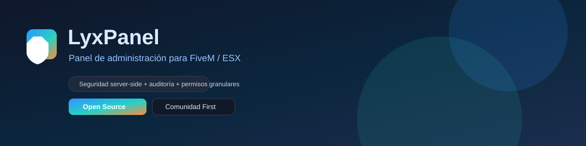

<div align="center">

# LyxPanel



### Panel de administracion **open source** para FiveM/ESX

<p align="center">
  <strong>Server-first</strong> • <strong>Permisos granulares</strong> • <strong>Auditoria real</strong> • <strong>Anti-spoof</strong>
</p>

<p align="center">
  <a href="docs/INSTALL_SERVER.md">📦 Instalacion</a> •
  <a href="docs/DEEP_DIVE.md">🔬 Deep Dive</a> •
  <a href="docs/CONFIG_REFERENCE.md">⚙️ Config</a> •
  <a href="docs/COMPARISON.md">🆚 Comparaciones</a>
</p>

[](LICENSE)


[](https://github.com/Floppa3210/lyx-panel/actions/workflows/qa.yml)
[](https://github.com/Floppa3210/lyx-panel/stargazers)

</div>

---

## Estado del proyecto
- Licencia: `MIT`
- Estado: `Activo`
- Enfoque: seguridad real del lado servidor + experiencia de staff
- Instalacion recomendada: **`lyx-panel` + `lyx-guard` juntos**

> Importante: podes ejecutar `lyx-panel` solo, pero la instalacion soportada/recomendada es tener ambos activos (`lyx-panel` + `lyx-guard`). Si falta uno, hay degradacion/inhabilitacion de features dependientes y perdes cobertura de seguridad.

## Por que existe
Muchos paneles/adminmenus de FiveM fallan en lo mas importante:
- eventos ejecutables por cualquiera (spoof)
- payloads sin validacion (tablas profundas/strings gigantes)
- permisos inconsistentes
- cero auditoria

LyxPanel esta disenado con un contrato simple:
- **el servidor valida y decide**
- **toda accion critica tiene permiso + rate-limit + schema validation**
- **las acciones admin usan token + nonce + anti-replay**
- **toda accion queda auditada**

<div align="center">

## Por que usar LyxPanel

</div>

<table>
<tr>
<td width="50%">

### Seguridad real (server-first)

```text
- Firewall de eventos (allowlist + schema + rate-limit)
- Token + nonce + anti-replay (acciones admin)
- Controles de payload (deep tables / strings enormes)
- Spoof de accion admin = permaban (+ escala a lyx-guard)
```

</td>
<td width="50%">

### Operacion de staff

```text
- 16 paginas NUI (players, vehiculos, economia, reports...)
- Permisos por rol + por usuario (desde UI, con auditoria)
- Tickets in-game + reportes + presets + outfits
- Herramientas de vehiculo avanzadas + troll + HUD admin
```

</td>
</tr>
</table>

## Que incluye (resumen)
- **Panel NUI** con 16 paginas: dashboard, players, vehicles, weapons, economy, world,
  reports, tickets, bans, detections, whitelist, history, logs, permissions, tools, settings.
- **Cientos de acciones admin** (`lyxpanel:action:*`), todas server-authoritative y auditadas.
- **Permisos granulares**: por rol y por usuario individual, respaldados en DB con auditoria de cambios
  (`permissions_store.lua`), + lista de acceso al panel editable en caliente (`access_store.lua`).
- **Firewall de eventos admin** (`event_firewall.lua`): allowlist + schema validation + rate-limit +
  token/nonce/anti-replay + sesion activa.
- **Tickets in-game** (`/report` + workflow de staff desde UI) y **sistema de reports** persistido en DB.
- **Features v4.5**: controles de vehiculo avanzados, teleport favorites, weapon kits, ban export/import,
  outfits, admin rankings, HUD de admin, reload de config en caliente.
- **Modo simulacion (dry-run)** para acciones destructivas.
- Integracion opcional con **lyx-guard** (reenvia intentos de spoof como deteccion).

## Acciones del panel (categorias)
Todas pasan por el firewall antes de ejecutarse. Resumen (nombres reales en `server/actions*.lua`):

| Categoria | Ejemplos |
|---|---|
| Moderacion | kick, ban, unban, warn, banOffline, banIPRange, reduceBan, editBan, jail/unjail, mute (chat/voz), addNote, wipePlayer |
| Economia | giveMoney, setMoney, removeMoney, transferMoney, giveMoneyAll |
| Inventario/Armas | giveWeapon, giveWeaponKit, giveAmmo, giveItem, removeItem, clearInventory |
| Vehiculos | spawnVehicle, repair, flip, boost, clean, color/plate/tune, livery/extra/neon/xenon/modkit, ghost, freeze, warp in/out |
| Teleport | teleportTo, bring, teleportCoords/Marker/Back, favoritos, jugador-a-jugador |
| Estado jugador | revive, reviveAll/radius, heal, setHealth/Armor, freeze, kill, slap, ragdoll, setJob, changeModel, clearArea |
| Self / toggles | noclip, godmode, invisible, speedboost, nitro, vehicleGodmode, spectate |
| Comunicacion | announce, scheduleAnnounce, privateMessage, adminChat |
| Mundo | setWeather, setTime |
| Reports/Tickets | assign, close, priority, tpToReporter, mensajes/plantillas; ticket assign/reply/close/reopen |
| Presets | self-presets, vehicle builds, favoritos, outfits |
| Otros | whitelist, licencias, troll (14 funciones), screenshots, clear logs/detections |

## Comandos y teclas
- `/lyxpanel` (o tecla `F6`) — abrir/cerrar el panel (`Config.OpenCommand` / `Config.OpenKey`).
- Alias legacy configurable (por defecto `/panel`).
- Staff (solo admin): `/staffrevive` (revivir con **E** al morir), `/infinitebullets`, `/instantrespawn`.
- `/report` — abrir un reporte in-game (jugadores).

## Instalacion rapida
1. Copiar `lyx-panel` a `resources/[local]/lyx-panel`.
2. Recomendado: copiar `lyx-guard` a `resources/[local]/lyx-guard`.
3. En `server.cfg`:
```cfg
ensure oxmysql
ensure es_extended
ensure lyx-guard
ensure lyx-panel
```
4. Reiniciar y revisar consola (migraciones + firewall).

Las tablas se crean solas via `server/migrations.lua` (runner versionado) — no hace falta
importar SQL a mano. `database_extended.sql` queda como referencia.

Guia completa:
- `docs/INSTALL_SERVER.md`

## Configuracion (entry points)
Archivo: `config.lua`

Acceso al panel:
```lua
Config.OpenCommand = 'lyxpanel'
Config.OpenKey = 'F6'
```

Perfil runtime:
```lua
Config.RuntimeProfile = 'default' -- rp_light | production_high_load | hostile
```

Secciones principales: `Security` (incl. `adminEventFirewall`), `Permissions`, `Discord`, `Weather`,
`SpawnPoints`, `Weapons`, `Vehicles`, `CustomVehicles`, `CommonItems`, `VehicleMods`, `Themes`,
`Locales`, `StaffCommands`, `TrollFunctions`, `WeaponKits`, `FuelScript`, `TeleportFavorites`,
`BanExportImport`, `AdminRankings`, `SelfAdminHud`.

Referencia completa:
- `docs/CONFIG_REFERENCE.md`

## Seguridad (resumen)
- **Server-authoritative**: nada critico se confia al cliente.
- Acciones `lyxpanel:action:*` con **allowlist + schema + rate-limit + token + nonce + anti-replay** y sesion activa.
- Un jugador sin acceso que intente spoofear una accion admin → tratado como cheat trigger (**permaban**), con opcion de reenviar a `lyx-guard`.
- Permisos por rol y por usuario respaldados en DB, con **auditoria de cambios** (`lyxpanel_permission_audit`).

Detalles:
- `docs/DEEP_DIVE.md`

## Base de datos
Migraciones versionadas crean, entre otras: `lyxpanel_reports`, `lyxpanel_report_messages`,
`lyxpanel_logs`, `lyxpanel_notes`, `lyxpanel_tickets`, `lyxpanel_transactions`, `lyxpanel_whitelist`,
`lyxpanel_ip_bans`, `lyxpanel_admin_stats`, `lyxpanel_teleport_favorites`, `lyxpanel_weapon_kits`,
`lyxpanel_outfits`, `lyxpanel_role_permissions`, `lyxpanel_individual_permissions`,
`lyxpanel_permission_audit`, `lyxpanel_access_list`, `lyxpanel_self_presets`, `lyxpanel_vehicle_builds`,
`lyxpanel_vehicle_favorites`, `lyxpanel_vehicle_spawn_history`.

## Testing / QA offline
Check de cobertura de schemas/allowlists (recomendado antes de release):
```bash
node tools/qa/check_events.js
```

## Estructura del proyecto
```text
lyx-panel/
  fxmanifest.lua
  config.lua
  database_extended.sql   # referencia (las tablas las crea migrations.lua)
  README.md
  LICENSE
  SECURITY.md
  CONTRIBUTING.md

  client/
    main.lua              # bridge NUI <-> servidor + comando/keybind
    features_v45.lua      # controles avanzados (vehiculo, teleport, kits...)
    freecam.lua           # camara libre
    spectate.lua          # espectar (dimension-safe)
    zones.lua             # limpieza de zona + warps personales
    toggles.lua           # estados admin (noclip/godmode/invisible...)
    staff_commands.lua    # revive con E + municion infinita
  server/
    event_firewall.lua    # firewall de acciones admin (allowlist/schema/rate/token/nonce)
    actions.lua           # acciones admin core
    actions_extended.lua  # acciones admin extendidas
    features_v45.lua      # backend features v4.5
    presets.lua           # self-presets / vehicle builds / favoritos
    reports.lua           # sistema de reports (DB + Discord)
    tickets.lua           # tickets in-game
    staff_commands.lua    # /staffrevive, /infinitebullets, /instantrespawn
    permissions_store.lua # overrides de permisos por rol/usuario (DB)
    access_store.lua      # lista de acceso al panel (DB)
    migrations.lua        # runner de migraciones versionado
    main.lua              # autorizacion + bootstrap
  shared/                 # utilidades compartidas
  html/                   # UI (NUI): 16 paginas + modal de jugador
  tools/qa/               # checks offline
  docs/                   # documentacion
```

## Contribuir
Si queres aportar:
1. Issues y PRs son bienvenidos.
2. Toda action nueva debe incluir:
   - permiso
   - rate-limit
   - schema validation
   - auditoria

Ver:
- `CONTRIBUTING.md`
- `SECURITY.md`
